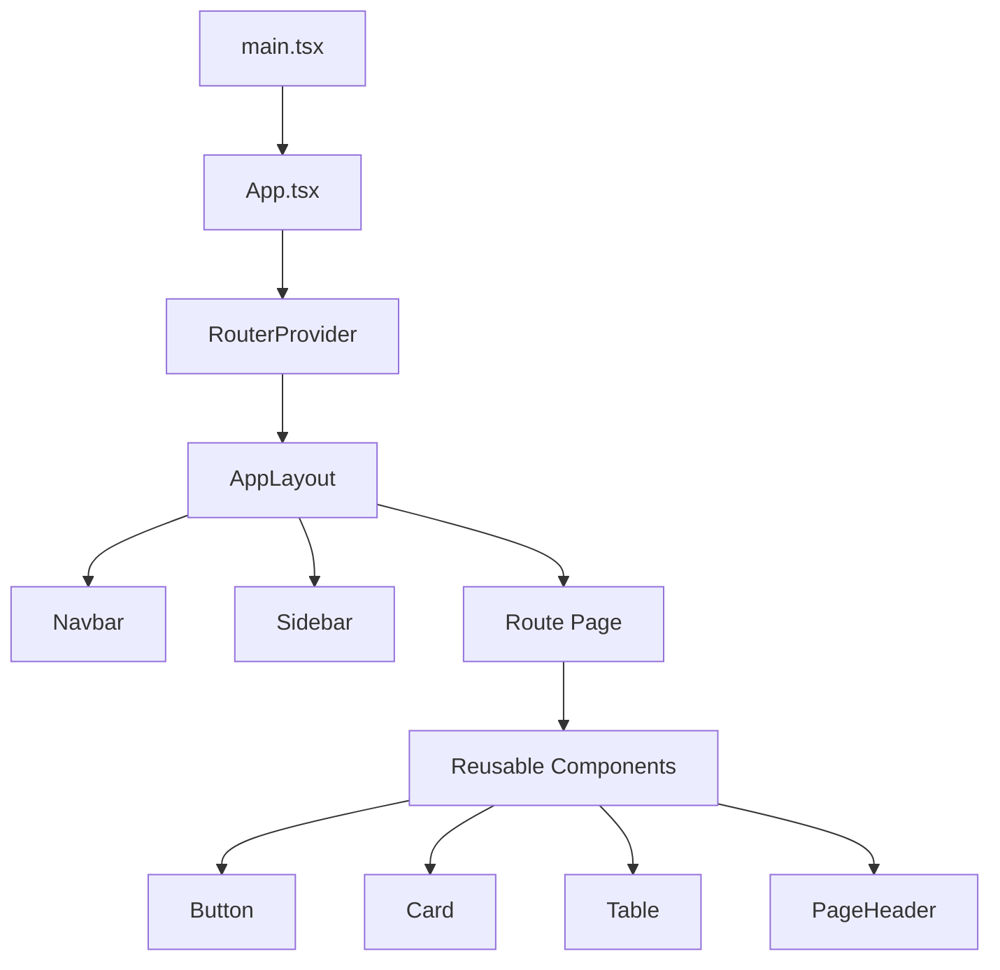
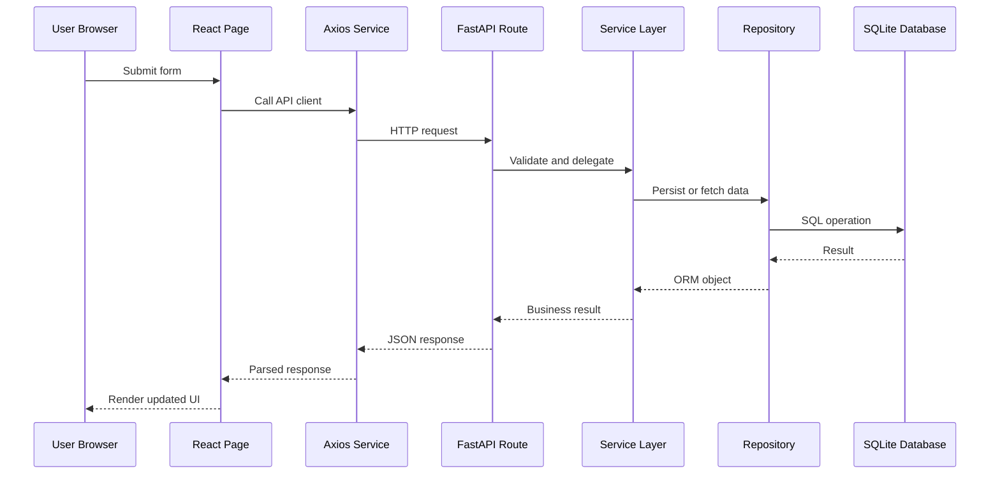
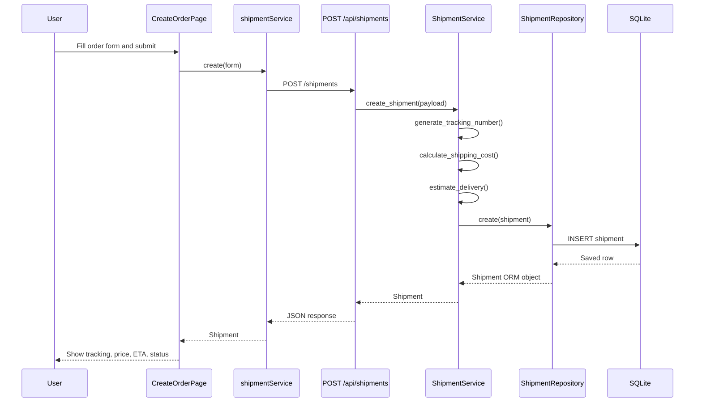
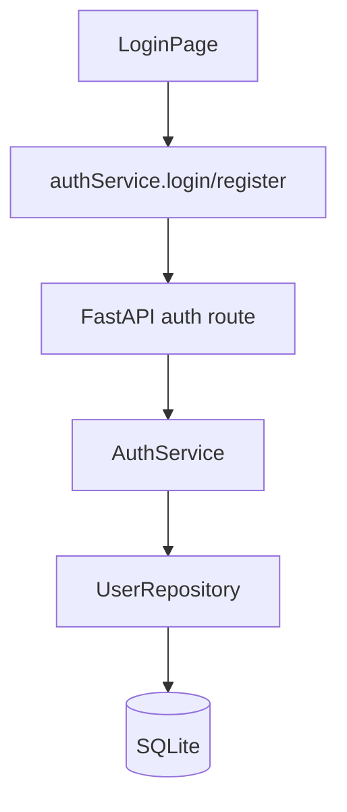

# Smart Freight Management System (SmartFM)

## 1. Project Overview

SmartFM is a university assignment project for a freight and logistics management system. It currently consists of:

- A `FastAPI` backend with layered architecture
- A `React + Vite + TypeScript + TailwindCSS` frontend
- A local `SQLite` database

The current objective is to provide a class-demo-ready monolith that can later evolve into a more complete Assignment 3 submission and, eventually, a microservice-oriented architecture.

### Main objective

The system is intended to support two broad user groups:

- Customers who create shipment orders
- Internal logistics staff who monitor shipments, fleets, drivers, assignments, reports, and payments

### Current development stage

This project is in an **early functional prototype** stage.

- The backend has working authentication, shipment CRUD, and CRUD skeletons for vehicles, drivers, and assignments.
- The frontend has a polished enterprise UI shell and multiple pages.
- The **only end-to-end feature wired from browser to database is shipment/order creation and shipment/order retrieval**.
- Several pages are currently present as UI prototypes with hardcoded data.

### Technologies used

| Layer | Technologies |
| --- | --- |
| Frontend | React 18, Vite, TypeScript, TailwindCSS, React Router, Axios |
| Backend | FastAPI, SQLAlchemy ORM, Pydantic, Uvicorn |
| Database | SQLite |
| Migration scaffold | Alembic |
| Styling | TailwindCSS with a custom enterprise theme |

### Overall architecture

The system is structured as a **layered monolith**:

```text
Frontend UI
  -> API service layer (Axios)
  -> FastAPI routes/controllers
  -> Service layer
  -> Repository layer
  -> SQLite database
```

The backend already separates:

- API routing
- business logic
- persistence logic
- data validation

This is a good starting point for future service extraction.

## 2. Folder Structure

### Top-level tree

```text
.
├── .gitignore
├── README.md
├── backend
│   ├── .venv
│   ├── alembic
│   ├── alembic.ini
│   ├── app
│   ├── app.db
│   └── requirements.txt
└── frontend
    ├── .env.example
    ├── index.html
    ├── node_modules
    ├── package-lock.json
    ├── package.json
    ├── postcss.config.js
    ├── src
    ├── tailwind.config.js
    ├── tsconfig.app.json
    ├── tsconfig.json
    ├── tsconfig.node.json
    └── vite.config.ts
```

### Top-level folder purposes

| Path | Purpose |
| --- | --- |
| `backend/` | Python backend application |
| `frontend/` | React frontend application |
| `backend/.venv/` | Local Python virtual environment created during development |
| `frontend/node_modules/` | Installed frontend dependencies |
| `backend/app.db` | SQLite database file |

### Backend tree

```text
backend/
├── alembic/
│   ├── env.py
│   ├── script.py.mako
│   └── versions/
├── alembic.ini
├── app/
│   ├── api/
│   │   ├── deps.py
│   │   ├── routes.py
│   │   └── v1/
│   ├── core/
│   │   └── config.py
│   ├── database/
│   │   └── session.py
│   ├── models/
│   ├── repositories/
│   ├── schemas/
│   ├── services/
│   ├── utils/
│   └── main.py
└── requirements.txt
```

### Backend folder responsibilities

| Path | Responsibility |
| --- | --- |
| `backend/app/main.py` | FastAPI app creation, CORS setup, router registration, startup table creation |
| `backend/app/api/` | HTTP layer |
| `backend/app/api/routes.py` | Aggregates all module routers |
| `backend/app/api/deps.py` | Shared dependencies, currently database session injection |
| `backend/app/api/v1/` | Versioned endpoint modules |
| `backend/app/core/config.py` | Application settings object |
| `backend/app/database/session.py` | SQLAlchemy engine, session factory, declarative base |
| `backend/app/models/` | SQLAlchemy ORM tables |
| `backend/app/schemas/` | Pydantic request/response models |
| `backend/app/services/` | Business logic |
| `backend/app/repositories/` | Database access logic |
| `backend/app/utils/security.py` | Password hashing and verification helpers |
| `backend/alembic/` | Migration scaffold only |
| `backend/requirements.txt` | Backend dependencies |

### Frontend tree

```text
frontend/src/
├── components/
├── hooks/
├── layouts/
├── pages/
├── router/
├── services/
├── types/
├── App.tsx
├── index.css
└── main.tsx
```

### Frontend folder responsibilities

| Path | Responsibility |
| --- | --- |
| `frontend/src/main.tsx` | React bootstrap entry point |
| `frontend/src/App.tsx` | Connects the router to React |
| `frontend/src/index.css` | Global Tailwind base and shared utility classes |
| `frontend/src/router/` | Route definitions |
| `frontend/src/layouts/` | Shared page shells |
| `frontend/src/components/` | Reusable UI building blocks |
| `frontend/src/pages/` | Route-level screens |
| `frontend/src/services/` | Axios API clients |
| `frontend/src/hooks/` | Reusable state logic |
| `frontend/src/types/` | Shared TypeScript types |

### Important frontend files

| File | Purpose |
| --- | --- |
| `frontend/index.html` | Vite HTML shell, imports Inter and Material Symbols |
| `frontend/vite.config.ts` | Vite config |
| `frontend/tailwind.config.js` | Tailwind theme tokens |
| `frontend/.env.example` | Frontend API base URL example |
| `frontend/src/router/index.tsx` | All client-side routes |
| `frontend/src/layouts/AppLayout.tsx` | Authenticated application shell |
| `frontend/src/services/api.ts` | Shared Axios instance |
| `frontend/src/services/authService.ts` | Auth API wrapper |
| `frontend/src/services/shipmentService.ts` | Shipment API wrapper |
| `frontend/src/hooks/useShipmentForm.ts` | Shared order/shipment form state |

## 3. Frontend Architecture

### Frontend style

The frontend is a **route-driven React application** built with reusable presentation components. There is no global state library such as Redux, Zustand, or Context-based domain store.

State is currently managed using:

- `useState`
- `useEffect`
- a single custom hook for shipment form state

### Component hierarchy

At a high level:



### Layouts

#### `AppLayout`

`frontend/src/layouts/AppLayout.tsx`

Responsibilities:

- wraps all authenticated pages
- renders the sidebar and navbar
- manages mobile sidebar open/close state
- renders page content through `<Outlet />`

The login page is intentionally outside this layout.

### Routing

Routes are defined in `frontend/src/router/index.tsx`.

| Route | Page |
| --- | --- |
| `/login` | `LoginPage` |
| `/` | `DashboardPage` |
| `/orders` | `OrdersPage` |
| `/orders/create` | `CreateOrderPage` |
| `/orders/:orderId` | `OrderDetailPage` |
| `/shipments/tracking` | `ShipmentTrackingPage` |
| `/fleet` | `FleetPage` |
| `/payment` | `PaymentPage` |
| `/reports` | `ReportsPage` |
| `/account` | `AccountPage` |

### Reusable components

The component layer is broad and mostly presentation-focused.

| Component | Role |
| --- | --- |
| `Button` | Styled button variants |
| `Input`, `Select`, `Textarea` | Form fields |
| `Card` | Surface container |
| `InfoCard`, `SummaryCard`, `StatCard` | Dashboard-style data cards |
| `StatusBadge` | Status label styling |
| `Timeline` | Vertical event timeline |
| `Navbar` | Top bar |
| `Sidebar` | Main navigation |
| `PageHeader` | Standard page heading and actions |
| `PageContainer` | Vertical page spacing wrapper |
| `Modal`, `ConfirmDialog` | Overlay patterns |
| `Table` | Generic table wrapper |
| `SearchBar` | Search input shell |
| `Pagination` | Static paging UI |
| `LoadingSpinner` | Spinner component |
| `EmptyState` | Empty list/message panel |
| `FormSection` | Grouped form layout |
| `MapCard` | Route/map placeholder |
| `Icon` | Material Symbols wrapper |

### Pages

The pages are split into:

- real API-backed pages
- partially API-backed pages
- static prototype pages

#### API-backed pages

- `LoginPage`
- `DashboardPage` (reads shipment list)
- `OrdersPage` (reads shipment list)
- `CreateOrderPage` (creates shipments/orders)
- `OrderDetailPage` (reads shipment by id)

#### Static prototype pages

- `ShipmentTrackingPage`
- `FleetPage`
- `PaymentPage`
- `ReportsPage`
- `AccountPage`

### State management

Current state management is local only:

- form state in `useShipmentForm`
- page-level `useState` for async data and UI mode toggles
- `useEffect` for simple fetch-on-load behavior

There is no:

- auth token store
- user session persistence
- query caching
- shared global domain state

### API layer

Frontend API communication is centralized under `frontend/src/services/`.

#### `api.ts`

Creates an Axios client with:

- `VITE_API_URL` if present
- fallback to `http://127.0.0.1:8000/api`

#### `authService.ts`

Methods:

- `register(payload)`
- `login(payload)`

#### `shipmentService.ts`

Methods:

- `list()`
- `create(payload)`
- `getById(shipmentId)`

No frontend service currently exists for:

- vehicles
- drivers
- assignments
- reports
- payments

### Utility logic

The only real shared UI logic hook is `useShipmentForm`.

It stores:

- sender
- receiver
- pickup address
- delivery address
- weight
- dimensions
- service type

This same model is used to submit a shipment/order to the backend.

## 4. Backend Architecture

### Backend style

The backend follows a classic layered pattern:

```text
FastAPI route -> Service -> Repository -> SQLAlchemy model -> SQLite
```

### Main startup flow

`backend/app/main.py` does the following:

1. imports the central API router
2. imports SQLAlchemy `Base` and `engine`
3. imports model modules so metadata is registered
4. calls `Base.metadata.create_all(bind=engine)`
5. creates the FastAPI app instance
6. configures CORS for local Vite development
7. mounts API routes under `/api`
8. exposes `/health`

### API/controllers

Controllers live in `backend/app/api/v1/`.

Current route modules:

- `auth.py`
- `shipments.py`
- `vehicles.py`
- `drivers.py`
- `assignments.py`
- `reports.py`

Routes are composed in `backend/app/api/routes.py`.

### Services

Service classes:

- `AuthService`
- `ShipmentService`
- `VehicleService`
- `DriverService`
- `AssignmentService`

Responsibilities:

- translate input schemas into models
- perform business logic
- call repositories
- return domain objects

Actual business logic is currently strongest in `ShipmentService`, which:

- generates a tracking number
- calculates shipping cost
- estimates delivery date
- recalculates values on update
- performs logical cancellation by status update

### Repositories

Repository classes:

- `UserRepository`
- `ShipmentRepository`
- `VehicleRepository`
- `DriverRepository`
- `AssignmentRepository`

Responsibilities:

- encapsulate database access
- perform queries
- commit transactions
- refresh ORM objects

### Models

Database tables are defined under `backend/app/models/`.

Current tables:

- `users`
- `shipments`
- `vehicles`
- `drivers`
- `assignments`
- `payments`

### Schemas

Pydantic schemas live in `backend/app/schemas/`.

They currently define:

- request payload validation
- response serialization

Pattern used:

- `Base` schema
- `Create` schema
- `Update` schema
- `Read` schema

### Database layer

`backend/app/database/session.py` defines:

- SQLAlchemy engine
- `SessionLocal`
- `Base`

The app uses SQLite with `check_same_thread=False` enabled.

### Configuration

`backend/app/core/config.py` contains a small in-code settings object:

- `app_name = "SmartFM"`
- `database_url = "sqlite:///./app.db"`

This is not environment-driven yet on the backend side.

## 5. Database

### Database engine

- Engine: SQLite
- File: `backend/app.db`
- ORM: SQLAlchemy 2.x style typed mappings

### Models and table purposes

| Model | Table | Purpose |
| --- | --- | --- |
| `User` | `users` | Stores registered users |
| `Shipment` | `shipments` | Stores shipment/order records |
| `Vehicle` | `vehicles` | Stores fleet vehicle records |
| `Driver` | `drivers` | Stores driver records |
| `Assignment` | `assignments` | Stores mappings between shipment, vehicle, and driver |
| `Payment` | `payments` | Placeholder payment record table |

### Model details

#### `User`

| Field | Type | Notes |
| --- | --- | --- |
| `id` | integer | Primary key |
| `full_name` | string | Required |
| `email` | string | Unique, indexed |
| `password_hash` | string | SHA-256 hash |
| `role` | string | Defaults to `customer` |

#### `Shipment`

| Field | Type | Notes |
| --- | --- | --- |
| `id` | integer | Primary key |
| `tracking_number` | string | Unique, indexed |
| `sender` | string | Required |
| `receiver` | string | Required |
| `pickup_address` | text | Required |
| `delivery_address` | text | Required |
| `weight` | float | Required |
| `dimensions` | string | Required |
| `service_type` | string | Required |
| `status` | string | Defaults to `Pending` |
| `estimated_price` | float | Calculated by service layer |
| `estimated_delivery_date` | date | Calculated by service layer |

#### `Vehicle`

| Field | Type | Notes |
| --- | --- | --- |
| `id` | integer | Primary key |
| `plate_number` | string | Unique, indexed |
| `type` | string | Vehicle category |
| `capacity` | float | Numeric capacity |
| `status` | string | Defaults to `Available` |

#### `Driver`

| Field | Type | Notes |
| --- | --- | --- |
| `id` | integer | Primary key |
| `full_name` | string | Required |
| `license_number` | string | Unique, indexed |
| `phone` | string | Required |
| `status` | string | Defaults to `Available` |

#### `Assignment`

| Field | Type | Notes |
| --- | --- | --- |
| `id` | integer | Primary key |
| `shipment_id` | integer nullable | Foreign key to `shipments.id` |
| `vehicle_id` | integer nullable | Foreign key to `vehicles.id` |
| `driver_id` | integer nullable | Foreign key to `drivers.id` |
| `status` | string | Defaults to `Planned` |

#### `Payment`

| Field | Type | Notes |
| --- | --- | --- |
| `id` | integer | Primary key |
| `shipment_id` | integer nullable | Foreign key to `shipments.id` |
| `amount` | float | Defaults to `0.0` |
| `status` | string | Defaults to `Pending` |

### Relationships

Foreign keys exist, but **SQLAlchemy relationship properties are not implemented yet**.

Current relational links:

- `assignments.shipment_id -> shipments.id`
- `assignments.vehicle_id -> vehicles.id`
- `assignments.driver_id -> drivers.id`
- `payments.shipment_id -> shipments.id`

Because ORM relationships are not defined:

- there is no eager/lazy navigation like `shipment.assignments`
- joins must be written manually if needed later

## 6. Application Flow

### High-level request flow



### Shipment/order creation flow

This is the most complete real flow in the project.



### Login flow



Important limitation:

- login does not create a session or token
- logout is only a dummy success response

## 7. Pages

| Page | Route | Purpose | API Used | Status |
| --- | --- | --- | --- | --- |
| Login | `/login` | Login/register UI | `/api/auth/register`, `/api/auth/login` | 🟡 Partial |
| Dashboard | `/` | Operations summary dashboard | `/api/shipments` | 🟡 Partial |
| Orders | `/orders` | List of orders | `/api/shipments` | 🟡 Partial |
| Create Order | `/orders/create` | Create a shipment/order | `/api/shipments` | ✅ Completed for demo flow |
| Order Detail | `/orders/:orderId` | View one shipment/order | `/api/shipments/{id}` | 🟡 Partial |
| Shipment Tracking | `/shipments/tracking` | Tracking UI | None | 🟡 Partial |
| Fleet | `/fleet` | Fleet management dashboard | None | 🟡 Partial |
| Payment | `/payment` | Payment summary UI | None | 🟡 Partial |
| Reports | `/reports` | Reports dashboard UI | None | 🟡 Partial |
| Account | `/account` | Account placeholder | None | ❌ Not implemented |

### Page-by-page detail

#### Login Page

- Purpose: register users and submit login credentials
- Components: `Button`, `Input`, `Icon`
- API endpoints used:
  - `POST /api/auth/register`
  - `POST /api/auth/login`
- Current implementation status:
  - registration works against backend
  - login works against backend
  - no redirect/auth guard/token persistence
- Missing features:
  - JWT/session management
  - remember me
  - password reset
  - protected routes

#### Dashboard Page

- Purpose: executive-style operational overview
- Components: `PageHeader`, `StatCard`, `Card`, `Table`, `Timeline`, `InfoCard`, `EmptyState`
- API endpoints used:
  - `GET /api/shipments`
- Current implementation status:
  - recent order table is API-backed
  - charts, counts, and timeline are hardcoded
- Missing features:
  - real KPIs
  - real chart data
  - live activity feed

#### Orders Page

- Purpose: list all created shipment orders
- Components: `SearchBar`, `Table`, `Pagination`, `StatusBadge`, `EmptyState`
- API endpoints used:
  - `GET /api/shipments`
- Current implementation status:
  - table data is real
  - search/filter/sort/pagination are visual only
- Missing features:
  - actual search logic
  - actual filtering
  - server/client pagination

#### Create Order Page

- Purpose: create a shipment through a structured order form
- Components: `FormSection`, `Input`, `Select`, `Textarea`, `Card`, `StatusBadge`
- API endpoints used:
  - `POST /api/shipments`
- Current implementation status:
  - form submits successfully
  - response is shown in UI
  - estimated cost and ETA preview are computed client-side before submit
- Missing features:
  - backend support for extra UI-only fields like pickup contact, declared value
  - stronger validation
  - success navigation

#### Order Detail Page

- Purpose: show one shipment record
- Components: `InfoCard`, `Card`, `Timeline`, `StatusBadge`
- API endpoints used:
  - `GET /api/shipments/{id}`
- Current implementation status:
  - shipment fields are real
  - invoice summary and timeline are mostly presentational
- Missing features:
  - not-found UX
  - real invoice/payment data
  - real event timeline

#### Shipment Tracking Page

- Purpose: shipment tracking experience
- Components: `MapCard`, `Timeline`, `StatusBadge`, `Card`
- API endpoints used:
  - None
- Current implementation status:
  - fully static UI
- Missing features:
  - tracking lookup input
  - backend tracking query
  - real location updates

#### Fleet Page

- Purpose: fleet dashboard
- Components: `SummaryCard`, `SearchBar`, `Table`, `Pagination`, `ConfirmDialog`
- API endpoints used:
  - None
- Current implementation status:
  - hardcoded demo data only
- Missing features:
  - integration with vehicles/drivers/assignments APIs
  - CRUD forms
  - real search/filter/pagination

#### Payment Page

- Purpose: payment/invoice screen
- Components: `Card`, `InfoCard`, `StatusBadge`
- API endpoints used:
  - None
- Current implementation status:
  - hardcoded demo data only
- Missing features:
  - payment backend
  - receipt files
  - invoice retrieval

#### Reports Page

- Purpose: management reporting UI
- Components: `StatCard`, `Card`, `Table`, `Button`
- API endpoints used:
  - None
- Current implementation status:
  - hardcoded charts and rows
- Missing features:
  - real reporting endpoints
  - export implementation
  - aggregated metrics

#### Account Page

- Purpose: account/profile placeholder
- Components: `PageHeader`, `Card`
- API endpoints used:
  - None
- Current implementation status:
  - placeholder only
- Missing features:
  - user profile retrieval
  - update actions
  - settings persistence

## 8. API Documentation

Base URL:

```text
http://127.0.0.1:8000/api
```

### Health

| Method | URL | Purpose | Status |
| --- | --- | --- | --- |
| `GET` | `/health` | Health check | ✅ Completed |

Response:

```json
{ "status": "ok" }
```

### Auth endpoints

#### `POST /api/auth/register`

| Item | Details |
| --- | --- |
| Purpose | Register a new user |
| Status | ✅ Completed |

Request body:

```json
{
  "full_name": "Jane Doe",
  "email": "jane@example.com",
  "password": "secret123",
  "role": "customer"
}
```

Success response:

```json
{
  "id": 1,
  "full_name": "Jane Doe",
  "email": "jane@example.com",
  "role": "customer"
}
```

Possible error:

- `400` if email already exists

#### `POST /api/auth/login`

| Item | Details |
| --- | --- |
| Purpose | Validate credentials |
| Status | 🟡 Partial |

Request body:

```json
{
  "email": "jane@example.com",
  "password": "secret123"
}
```

Success response:

```json
{
  "message": "Login successful",
  "user_id": 1,
  "email": "jane@example.com"
}
```

Notes:

- no token is returned
- no session is created

#### `POST /api/auth/logout`

| Item | Details |
| --- | --- |
| Purpose | Placeholder logout response |
| Status | 🟡 Partial |

Response:

```json
{ "message": "Logout successful" }
```

### Shipment endpoints

#### `POST /api/shipments`

| Item | Details |
| --- | --- |
| Purpose | Create shipment/order |
| Status | ✅ Completed |

Request body:

```json
{
  "sender": "Sender A",
  "receiver": "Receiver B",
  "pickup_address": "123 Pickup Street",
  "delivery_address": "456 Delivery Avenue",
  "weight": 10.5,
  "dimensions": "100x80x60 cm",
  "service_type": "Express"
}
```

Response:

```json
{
  "id": 1,
  "tracking_number": "SFM-20260727-1234",
  "sender": "Sender A",
  "receiver": "Receiver B",
  "pickup_address": "123 Pickup Street",
  "delivery_address": "456 Delivery Avenue",
  "weight": 10.5,
  "dimensions": "100x80x60 cm",
  "service_type": "Express",
  "status": "Pending",
  "estimated_price": 90.3,
  "estimated_delivery_date": "2026-07-29"
}
```

#### `GET /api/shipments`

| Item | Details |
| --- | --- |
| Purpose | List all shipments |
| Status | ✅ Completed |

Response:

- array of shipment objects

#### `GET /api/shipments/{shipment_id}`

| Item | Details |
| --- | --- |
| Purpose | Get one shipment |
| Status | ✅ Completed |

Possible errors:

- `404 Shipment not found`

#### `PUT /api/shipments/{shipment_id}`

| Item | Details |
| --- | --- |
| Purpose | Update shipment fields |
| Status | ✅ Completed |

Notes:

- if `weight` or `service_type` changes, price and ETA are recalculated

#### `DELETE /api/shipments/{shipment_id}`

| Item | Details |
| --- | --- |
| Purpose | Cancel a shipment |
| Status | 🟡 Partial |

Important:

- this does **not** physically delete the row
- it sets `status = "Cancelled"` and returns `204`

### Vehicle endpoints

| Method | URL | Purpose | Status |
| --- | --- | --- | --- |
| `GET` | `/api/vehicles` | List vehicles | ✅ Completed |
| `POST` | `/api/vehicles` | Create vehicle | ✅ Completed |
| `PUT` | `/api/vehicles/{vehicle_id}` | Update vehicle | ✅ Completed |
| `DELETE` | `/api/vehicles/{vehicle_id}` | Delete vehicle | ✅ Completed |

Notes:

- there is no `GET /api/vehicles/{id}`
- frontend does not use these endpoints yet

### Driver endpoints

| Method | URL | Purpose | Status |
| --- | --- | --- | --- |
| `GET` | `/api/drivers` | List drivers | ✅ Completed |
| `POST` | `/api/drivers` | Create driver | ✅ Completed |
| `PUT` | `/api/drivers/{driver_id}` | Update driver | ✅ Completed |
| `DELETE` | `/api/drivers/{driver_id}` | Delete driver | ✅ Completed |

Notes:

- there is no `GET /api/drivers/{id}`
- frontend does not use these endpoints yet

### Assignment endpoints

| Method | URL | Purpose | Status |
| --- | --- | --- | --- |
| `GET` | `/api/assignments` | List assignments | ✅ Completed |
| `POST` | `/api/assignments` | Create assignment | ✅ Completed |
| `PUT` | `/api/assignments/{assignment_id}` | Update assignment | ✅ Completed |
| `DELETE` | `/api/assignments/{assignment_id}` | Delete assignment | ✅ Completed |

Notes:

- there is no `GET /api/assignments/{id}`
- frontend does not use these endpoints yet

### Report endpoints

| Method | URL | Purpose | Status |
| --- | --- | --- | --- |
| `GET` | `/api/reports/summary` | Report summary placeholder | ❌ Not implemented |
| `GET` | `/api/reports/shipments` | Shipment report placeholder | ❌ Not implemented |

Current response:

```json
{ "message": "Report summary endpoint placeholder" }
```

or

```json
{ "message": "Shipment report endpoint placeholder" }
```

### Payment API

**Not implemented yet.**

- Payment table exists
- Payment routes, schemas, repository, and service do not exist

## 9. Current Features

| Feature | Status | Notes |
| --- | --- | --- |
| Authentication register | ✅ Completed | Persists users in DB |
| Authentication login | 🟡 Partial | Validates credentials but no token/session |
| Logout | 🟡 Partial | Dummy success response |
| Order creation | ✅ Completed | Uses shipment backend |
| Order list | ✅ Completed | Reads shipment list |
| Order detail | 🟡 Partial | Real shipment fetch plus static surrounding content |
| Shipment tracking | ❌ Not implemented | Static UI only |
| Shipment update API | ✅ Completed | Backend only |
| Shipment cancel API | 🟡 Partial | Logical cancel, not true delete |
| Fleet backend CRUD | ✅ Completed | Vehicles, drivers, assignments |
| Fleet frontend | ❌ Not implemented | UI uses hardcoded data only |
| Payment backend | ❌ Not implemented | Table only |
| Payment frontend | ❌ Not implemented | Static UI only |
| Reports backend | ❌ Not implemented | Placeholder endpoints only |
| Reports frontend | ❌ Not implemented | Static UI only |
| Dashboard | 🟡 Partial | Mix of API-backed and hardcoded metrics |
| Account page | ❌ Not implemented | Placeholder UI only |

## 10. Development Roadmap

### Account Management

- implement authenticated session or JWT
- add user profile retrieval/update
- add roles and access control

### Order

- support more order fields in backend
- add validation messages
- add edit and cancel actions in UI

### Shipment

- implement real tracking lookup workflow
- store shipment history/events
- add status transitions and audit trail

### Fleet

- connect frontend to vehicle/driver/assignment APIs
- add create/edit/delete dialogs and forms
- add actual filtering and pagination

### Payment

- add payment schemas, repository, service, routes
- connect payment page to backend
- support receipt file references

### Reports

- implement aggregated report queries
- replace placeholder charts with real data
- support export actions

## 11. Dependencies

### Backend dependencies

| Dependency | Why it exists |
| --- | --- |
| `fastapi` | HTTP API framework |
| `uvicorn[standard]` | ASGI server for running FastAPI |
| `sqlalchemy` | ORM and SQL abstraction |
| `pydantic` | Request/response validation and typed settings |
| `email-validator` | Supports `EmailStr` validation in Pydantic |
| `alembic` | Database migration framework scaffold |

### Frontend runtime dependencies

| Dependency | Why it exists |
| --- | --- |
| `react` | UI library |
| `react-dom` | Browser rendering for React |
| `react-router-dom` | Client-side routing |
| `axios` | HTTP client for API calls |

### Frontend development dependencies

| Dependency | Why it exists |
| --- | --- |
| `vite` | Dev server and build tool |
| `typescript` | Static typing |
| `@vitejs/plugin-react` | React support in Vite |
| `tailwindcss` | Utility-first styling |
| `postcss` | CSS processing |
| `autoprefixer` | CSS vendor prefixing |
| `@types/react` | React TypeScript types |
| `@types/react-dom` | ReactDOM TypeScript types |

## 12. Running the Project

### Backend setup

```bash
cd /Users/doangiahan/Documents/ASM3/backend
python3 -m venv .venv
source .venv/bin/activate
pip install -r requirements.txt
uvicorn app.main:app --reload
```

Backend default URL:

```text
http://127.0.0.1:8000
```

### Frontend setup

```bash
cd /Users/doangiahan/Documents/ASM3/frontend
npm install
npm run dev
```

Frontend default URL:

```text
http://127.0.0.1:5173
```

### Environment variables

Frontend:

```bash
cp .env.example .env
```

Example:

```env
VITE_API_URL=http://127.0.0.1:8000/api
```

Backend:

- No `.env` or environment-based config is implemented yet.

### Database migration

Alembic is scaffolded, but no migration revisions are present yet.

Useful commands once revisions are created:

```bash
cd /Users/doangiahan/Documents/ASM3/backend
source .venv/bin/activate
alembic revision --autogenerate -m "initial schema"
alembic upgrade head
```

Important current behavior:

- the app currently relies on `Base.metadata.create_all(...)` at startup
- Alembic exists, but migration history is not active yet

## 13. How to Develop

### How to add a page

1. Create a new page under `frontend/src/pages/`
2. Reuse shared components from `frontend/src/components/`
3. Add a route in `frontend/src/router/index.tsx`
4. Add sidebar navigation in `frontend/src/components/Sidebar.tsx` if needed
5. If the page needs data, add a service wrapper under `frontend/src/services/`

### How to add an API

1. Add or update a Pydantic schema in `backend/app/schemas/`
2. Add business logic to a service in `backend/app/services/`
3. Add persistence methods in the repository under `backend/app/repositories/`
4. Expose the route in `backend/app/api/v1/`
5. Register the router in `backend/app/api/routes.py` if it is a new module

### How to add a database model

1. Create the model in `backend/app/models/`
2. Import it in `backend/app/models/__init__.py`
3. Create matching schemas if needed
4. Create repository methods
5. Create service methods
6. Add API routes if the model should be exposed
7. Add an Alembic revision in future once migrations are actively used

### How frontend communicates with backend

```text
Page component
  -> service wrapper in frontend/src/services
  -> shared Axios client in api.ts
  -> FastAPI route under /api
  -> service layer
  -> repository
  -> SQLite
```

### Current coding conventions observed

- backend uses one service class per domain
- backend uses one repository class per domain
- routes are thin and delegate to services
- frontend uses functional components
- frontend favors composition through reusable UI components
- TypeScript types are kept under `src/types`

## 14. Known Issues

### Incomplete features

- no frontend integration for vehicles, drivers, assignments
- payment backend missing
- report backend missing
- account management missing
- shipment tracking is static

### Hardcoded data

The following pages include hardcoded UI/demo data:

- `DashboardPage`
- `ShipmentTrackingPage`
- `FleetPage`
- `PaymentPage`
- `ReportsPage`
- `AccountPage`
- parts of `OrderDetailPage`

### Missing validation or behavior gaps

- login has no session/token behavior
- logout is not real
- order form includes UI-only fields not supported by backend
- search/filter/pagination are non-functional UI shells
- no tests are present

### Persistence/architecture issues

- passwords use raw SHA-256 without salting or modern password hashing
- backend settings are hardcoded in Python
- SQLAlchemy relationships are not defined
- `create_all` and Alembic scaffold coexist, but migrations are not actually driving schema state

### API limitations

- no `GET by id` for vehicles, drivers, assignments
- no payment endpoints
- report endpoints return placeholder messages only

## 15. Architecture Review

### Strengths

- clear separation between API, services, repositories, models, and schemas
- easy to understand for new developers
- frontend component reuse is strong
- route structure is clean and easy to extend
- backend already points toward microservice separation by domain

### Weaknesses

- several frontend pages are UI-only and not connected to backend
- backend domain coverage is uneven
- no authentication/session architecture beyond credential checking
- no tests, no logging strategy, no error standardization
- database relationships are not modeled beyond foreign keys

### Code duplication

Duplication is moderate, not severe.

Examples:

- CRUD service patterns for vehicles, drivers, and assignments are very similar
- CRUD repository patterns are also repeated

This duplication is acceptable at this project size, but could later be reduced with shared base abstractions if the team wants to standardize patterns.

### Scalability

Current scalability is limited by:

- SQLite
- no async data pipeline
- no background jobs
- no caching
- all features running in one monolith

Still, the backend layering makes future refactoring feasible.

### Maintainability

Maintainability is reasonably good for a prototype because:

- responsibilities are separated
- folders are intuitive
- naming is consistent

Maintainability risks:

- static demo pages may drift away from backend reality
- no tests to protect refactors
- frontend/backend feature mismatch

### Microservice readiness

The codebase is **conceptually microservice-ready**, but not operationally microservice-ready yet.

Good signs:

- domain-based service separation
- repository/service boundaries
- modular API routing

Missing pieces:

- no service boundaries at deployment level
- no inter-service contracts/events
- shared database monolith
- no auth token strategy for distributed services

## 16. Improvement Suggestions

### High priority

1. Implement real authentication with JWT or session-based auth.
2. Connect fleet, payment, and reports pages to backend APIs.
3. Replace placeholder report endpoints with real aggregation logic.
4. Introduce secure password hashing such as `passlib`/`bcrypt` or `pwdlib`.
5. Add tests for shipment creation, auth, and core CRUD flows.

### Medium priority

1. Add real Alembic migrations and stop relying on startup `create_all`.
2. Add SQLAlchemy relationship mappings.
3. Add backend configuration via environment variables.
4. Add not-found/loading/error states across all frontend pages.
5. Implement real pagination, sorting, and filtering.

### Low priority

1. Add charting libraries for reports and dashboard visuals.
2. Add map integration for shipment tracking.
3. Add file/receipt handling for payments.
4. Standardize API response envelopes if the team prefers that style.

## Quick Summary

SmartFM already has a solid architectural foundation and a polished UI shell. The backend shipment flow is the most complete working path, while several surrounding modules currently exist as either CRUD skeletons or frontend prototypes. A new developer can safely treat this codebase as a **well-structured prototype with one real end-to-end business flow and several partially implemented modules ready for expansion**.
